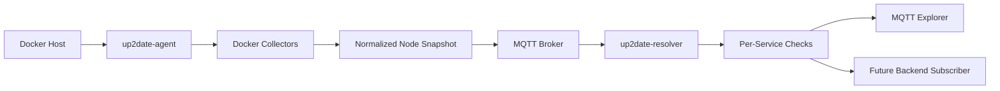

# Architecture

## Current MVP Model

The architecture is built around three distinct responsibilities:

1. Docker-side current-state collection
2. Snapshot normalization
3. MQTT publication and resolution

Latest-version resolution and comparison are now handled by a separate resolver process and should remain separate from host-side collection.

## Current Components

### Agent

Runs on or near the target environment.

Responsibilities:

- execute collectors locally
- enrich observations with node metadata
- publish full node snapshots to MQTT
- operate with least privilege

Expected deployment forms:

- container sidecar in a Compose project
- small daemon on a VM or bare-metal node later

### MQTT Broker

Current transport layer.

Responsibilities:

- accept repeated retained snapshots from agents
- distribute raw snapshots to downstream consumers
- distribute retained per-service checks from the resolver
- stay dumb during the MVP phase

### Resolver

Consumes snapshots and publishes per-service check results.

Responsibilities:

- subscribe to node snapshots
- query registries for newer release tags
- compare current and latest versions per service
- publish `checks/<service>` topics

### Observer

Current debugging surface.

Responsibilities:

- inspect topics and payloads
- validate freshness and data shape
- drive refinements of the snapshot contract

Expected forms:

- MQTT Explorer
- future backend subscriber
- future web UI

## Current Boundaries

### Collectors

Collectors determine the current deployed state.

Examples:

- `docker_engine`
- `docker_compose_labels`

Normalized service output:

```json
{
  "container_id": "8f69a0d8d5d4",
  "container_name": "media-plex-1",
  "service_name": "plex",
  "project_name": "media",
  "image": "lscr.io/linuxserver/plex:1.41.8",
  "image_name": "lscr.io/linuxserver/plex",
  "image_tag": "1.41.8",
  "detected_version": "1.41.8",
  "detected_version_source": "image_tag",
  "state": "running",
  "running": true,
  "status": "Up 23 minutes",
  "observed_via": "docker_engine"
}
```

### Snapshots

The snapshot is the current wire contract.

Normalized node snapshot:

```json
{
  "schema_version": 1,
  "kind": "docker_node_snapshot",
  "agent_id": "docker-host-01",
  "node_name": "Docker Host 01",
  "observed_at": "2026-03-24T18:42:00Z",
  "services": []
}
```

Future resolver and comparison layers must consume this normalized model instead of coupling themselves to Docker-specific raw data.

### Checks

Checks are derived messages published by the resolver.

Normalized service check:

```json
{
  "schema_version": 1,
  "kind": "service_check",
  "node_id": "docker-host-01",
  "service_name": "plex",
  "current_version": "1.41.8",
  "latest_version": "1.42.0",
  "status": "outdated",
  "update_available": true,
  "resolver": "docker_registry"
}
```

## Data Flow



## Data Entities

### Node

A reporting source, typically one Docker host with one agent.

### Service

A tracked runtime unit derived from a Docker container and optional Compose labels.

### Snapshot

One full message containing the last observed state of a node.

### Status Summary

A lightweight retained summary derived from the snapshot.

### Service Check

A retained per-service result derived from one snapshot plus resolver logic. This topic is intentionally compact and keeps only the user-facing update outcome, while the snapshot topic remains the detailed technical record.

## Security Notes

- Prefer outbound agent push over central privileged access.
- Scope Docker access to the local socket only.
- Keep MQTT credentials scoped to publish-only when possible.
- Avoid requiring root unless a collector truly needs it.
- Make sensitive configuration sources explicit.

## First Concrete Implementation Slice

The easiest end-to-end slice is:

1. `docker_engine` collector
2. Docker Compose metadata extraction from labels
3. `up2date/nodes/<node-id>/snapshot`
4. `up2date/nodes/<node-id>/status`
5. `up2date/nodes/<node-id>/checks/<service>`
6. local inspection in MQTT Explorer
